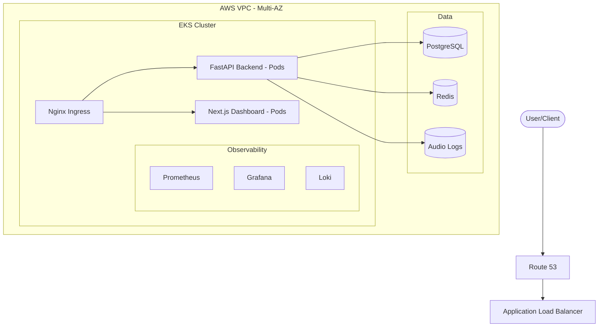

# 🎙️ AI Voice Agent Infrastructure Platform

[](https://www.terraform.io/)
[](https://kubernetes.io/)
[](https://aws.amazon.com/)
[](https://nextjs.org/)
[](https://fastapi.tiangolo.com/)

A production-ready, scalable infrastructure platform for deploying and managing AI-powered voice and chat agents. This project demonstrates enterprise-grade DevOps practices, including Infrastructure as Code (IaC), Kubernetes orchestration, automated CI/CD, and comprehensive observability.

---

## 🚀 Overview

This platform provides the "plumbing" for modern AI voice agents. It handles high-concurrency WebSocket streaming, automatic scaling based on call volume, and provides a centralized dashboard for monitoring agent performance and costs.

### Why this exists?
Building an AI voice agent is easy; scaling it to thousands of concurrent users with sub-100ms latency while maintaining security and observability is **hard**. This project solves that complexity.

---

## 🏗️ Architecture

The system is built on **AWS EKS** (Elastic Kubernetes Service) for maximum reliability and scalability.

### Core Components
- **Infrastructure**: Provisioned via **Terraform** (VPC, EKS, RDS, Redis, S3).
- **Backend**: **FastAPI** (Python) with WebSocket support for real-time audio processing.
- **Frontend**: **Next.js** Dashboard with glassmorphic UI for agent management.
- **Ingress**: **Nginx Ingress Controller** with automated SSL via **Cert-Manager**.
- **Observability**: Full-stack monitoring with **Prometheus**, **Grafana**, and **Loki**.

### Architecture Diagram


---

## ✨ Key Features

- **✅ Kubernetes-based Deployment**: Fully containerized microservices architecture.
- **✅ Automated Scaling**: HPA (Horizontal Pod Autoscaler) and Cluster Autoscaler for dynamic loads.
- **✅ Infrastructure as Code**: Entire AWS environment reproducible with a single `terraform apply`.
- **✅ CI/CD Pipelines**: Automated testing, building, and deployment via GitHub Actions.
- **✅ Centralized Logging**: Real-time log aggregation with Grafana Loki.
- **✅ Prometheus Monitoring**: Custom dashboards for tracking latency and concurrent streams.
- **✅ Cost Optimization**: Optimized for AWS Spot Instances and S3 Lifecycle policies.
- **✅ Security Best Practices**: IAM Roles for Service Accounts (IRSA), Secret encryption, and private networking.

---

## 🛠️ Tech Stack

- **Cloud**: AWS (EKS, RDS, ElastiCache, S3, Route53, IAM)
- **IaC**: Terraform
- **Orchestration**: Kubernetes (Helm / Kustomize)
- **Languages**: Python (FastAPI), TypeScript (Next.js)
- **CI/CD**: GitHub Actions
- **Monitoring**: Prometheus, Grafana, Loki
- **Networking**: Nginx Ingress, Cert-Manager, TLS/SSL

---

## 📂 Repository Structure

```bash
ai-voice-platform/
├── terraform/          # IaC for AWS Resources
├── kubernetes/         # K8s Manifests (Deployment, Service, HPA)
├── docker/             # Optimized Dockerfiles for all services
├── monitoring/         # Grafana Dashboards & Alerting Rules
├── .github/workflows/  # CI/CD Pipelines
├── backend/            # FastAPI Voice Processing Engine
├── frontend/           # Next.js Management Dashboard
├── docs/               # Deep-dive Architecture & User Guides
└── README.md           # Portfolio Home
```

---

## 🏁 Getting Started

### Prerequisites
- AWS Account & CLI configured
- Terraform >= 1.5
- kubectl & Helm

### 1. Infrastructure Provisioning
```bash
cd terraform
terraform init
terraform apply -auto-approve
```

### 2. Kubernetes Deployment
```bash
cd kubernetes
kubectl apply -k overlays/prod
```

---

## 📊 Observability & Monitoring

Once deployed, you can access the monitoring stack:
- **Grafana**: `https://grafana.yourdomain.com` (Dashboards for EKS & Application)
- **Prometheus**: Internal scraping of `/metrics` endpoints.

---

## 🤝 Contact & Portfolio

<<<<<<< HEAD
Built with ❤️ by **[Sanjana Mahajan]**.
- **LinkedIn**: [www.linkedin.com/in/sanjana-mahajan-467982233)
- **Email**: [sanjanamaahi2001@gmail.com](mailto:sanjanamaahi2001@gmail.com)
=======
Built with ❤️ by **Sanjana**.
- **Portfolio**: [personal-portfolio-gold-phi-44.vercel.app](https://personal-portfolio-gold-phi-44.vercel.app)
- **LinkedIn**: [linkedin.com/in/sanjana-mahajan-467982233/](https://www.linkedin.com/in/sanjana-mahajan-467982233/)
- **Email**: [sanjanamaahi2001@gmail.com](mailto:sanjanamaahi2001@gmail.com)

---
