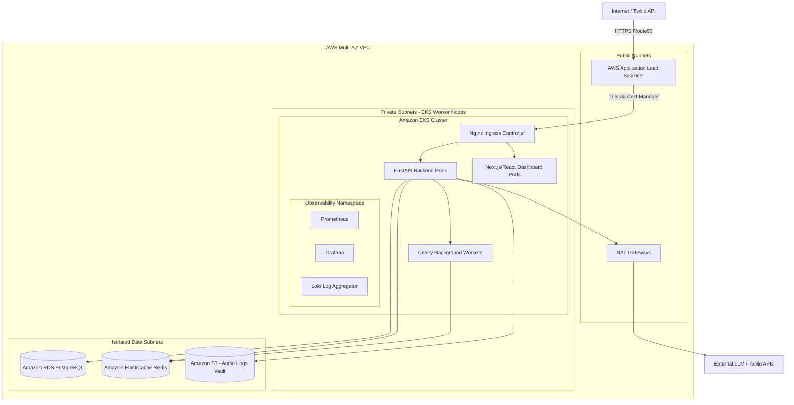
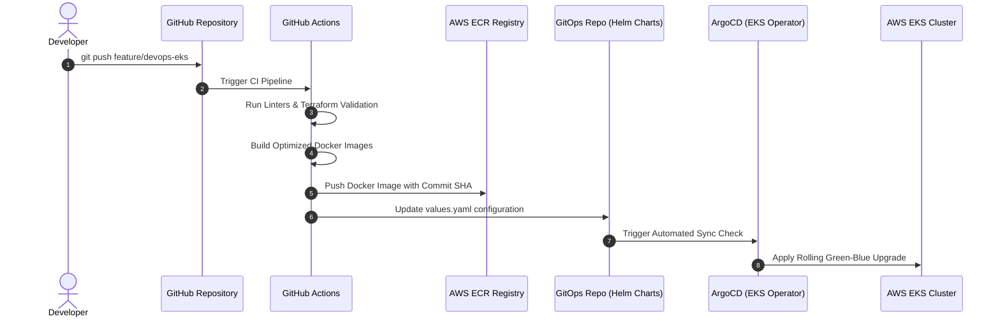

# 🎙️ AI Voice Infrastructure Platform

[](https://www.terraform.io/)
[](https://kubernetes.io/)
[](https://aws.amazon.com/)
[](https://nextjs.org/)
[](https://fastapi.tiangolo.com/)

A production-ready, highly scalable infrastructure platform for deploying and managing cloud-native voice-processing and AI-telephony applications. This repository automates the multi-AZ AWS network routing, EKS cluster provisioning, Helm deployment packaging, containerization, and Prometheus/Grafana/Loki observability patterns.

---

## 🔗 Portfolio Repositories Linkage

This project is split into two sister repositories to separate business application logic from cloud infrastructure engineering:
* **Application Codebase**: Contains the core conversational AI engines, telephony flow runtime, campaign managers, and real-time agent console.
  👉 **[Go to AI Voice Bot Application Repository](https://github.com/sanjanamahajan2001-sys/Alcon-AI-voice-agent)**
* **Infrastructure & Deployment Codebase (This Repository)**: Contains the Terraform IaC configurations, AWS EKS networking modules, Kubernetes/Helm deployment manifests, Docker containers, and Prometheus/Grafana/Loki monitoring dashboards.
  👉 **[Go to AI Voice Infrastructure Platform Repository](https://github.com/sanjanamahajan2001-sys/AI-Voice-Infrastructure-Platform)**

---

## 🎯 Project Goals

This project was created to explore and demonstrate:
- **Scalable Kubernetes patterns** for high-concurrency WebSocket and real-time media stream voice applications.
- **Reusable Terraform modules** for multi-AZ AWS infrastructure supporting PostgreSQL, Redis, and S3.
- **Production-style CI/CD workflows** for automated container builds, validation scans, and EKS deployments.
- **Cloud-native observability** for tracking network traffic, P99 audio latency, stream density, and logging profiles.
- **Cost-optimized compute** using selective EC2 nodes and HPA parameters.

---

## 🏗️ Architecture

The system is built on **AWS EKS** (Elastic Kubernetes Service) to handle dynamic, high-concurrency real-time conversational voice processing.

### Infrastructure Components
- **IaC**: Modular, reusable Terraform configurations provisioning VPC, AWS EKS, RDS PostgreSQL, and ElastiCache Redis.
- **Backend Service**: Highly optimized containers hosting asynchronous FastAPI engines with live-stream Media socket support.
- **Frontend/Dashboard**: Responsive dashboards for agent management and CTI screen-pops.
- **Networking**: High-performance Nginx Ingress Controllers with AWS Application Load Balancer and Cert-Manager for automatic SSL termination.

### 1. System Architecture



### 2. CI/CD Deployment Flow



---

## 🛠️ Validation & Testing

The infrastructure workflows and deployment patterns were validated using:
- **Local Kubernetes**: Validated manifests using `minikube` and `k3d`.
- **Terraform Validation**: Extensive use of `terraform plan` and `tflint`.
- **Container Testing**: Docker-based testing for FastAPI and Next.js services.
- **CI Workflows**: GitHub Actions pipelines for automated validation on every push.

*Note: The repository is structured for deployment on AWS EKS environments.*

---

## 📊 Example Outputs

### Terraform Plan Output
```text
terraform plan
...
Plan: 24 to add, 0 to change, 0 to destroy.
```

### Kubernetes Pod Status
```text
kubectl get pods -n voice-agent

NAME                             READY   STATUS    RESTARTS   AGE
voice-backend-7d89f4b5-x2p89     1/1     Running   0          12m
voice-frontend-5d9d9f8c-m9lqz    1/1     Running   0          12m
redis-master-0                   1/1     Running   0          45m
prometheus-server-abc12          1/1     Running   0          2h
```

### CI/CD Pipeline Status
```text
✓ Linting & Security Scan
✓ Terraform Validation
✓ Docker Build & Push (ECR)
✓ Kubernetes Deployment (EKS)
```

---

## 🚀 Future Improvements

- **GitOps Integration**: Moving from push-based CI to ArgoCD for state synchronization.
- **Canary Deployments**: Implementing Flagger for progressive delivery.
- **Distributed Tracing**: Adding OpenTelemetry for tracking audio packet latency.
- **Multi-Region Support**: Infrastructure modules for cross-region failover.

---

## 📂 Repository Structure

```bash
ai-voice-platform/
├── terraform/          # IaC for AWS Resources
├── kubernetes/         # K8s Manifests (Deployment, Service, HPA)
├── docker/             # Optimized Dockerfiles for all services
├── monitoring/         # Grafana Dashboards & Alerting Rules
├── .github/workflows/  # CI/CD Pipelines
├── backend/            # FastAPI Voice Processing Engine
├── frontend/           # Next.js Management Dashboard
└── README.md           # Project Documentation
```

---

## 🤝 Contact
Built by **Sanjana Mahajan**.
- **Portfolio**: [personal-portfolio-gold-phi-44.vercel.app](https://personal-portfolio-gold-phi-44.vercel.app)
- **LinkedIn**: [linkedin.com/in/sanjana-mahajan-467982233/](https://www.linkedin.com/in/sanjana-mahajan-467982233/)
- **Email**: [sanjanamaahi2001@gmail.com](mailto:sanjanamaahi2001@gmail.com)
