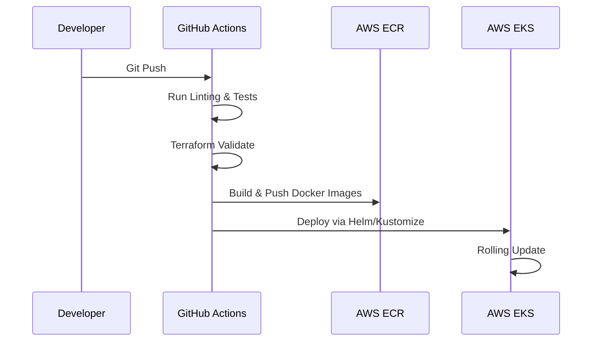

# 🎙️ AI Voice Infrastructure Platform

[](https://www.terraform.io/)
[](https://kubernetes.io/)
[](https://aws.amazon.com/)
[](https://nextjs.org/)
[](https://fastapi.tiangolo.com/)

A production-ready, scalable infrastructure platform for deploying and managing voice-processing applications. This project implements production-oriented deployment workflows, infrastructure automation via IaC, and cloud-native observability patterns.

---

## 🎯 Project Goals

This project was created to explore and demonstrate:
- **Scalable Kubernetes patterns** for high-concurrency WebSocket applications.
- **Reusable Terraform modules** for multi-AZ AWS infrastructure.
- **Production-style CI/CD workflows** for automated builds and deployments.
- **Cloud-native observability** for tracking P99 latency and stream density.
- **Cost-optimized compute** using AWS Spot Instances for audio processing.

---

## 🏗️ Architecture

The system is built on **AWS EKS** (Elastic Kubernetes Service) to handle dynamic audio processing loads.

### Infrastructure Components
- **IaC**: Modular Terraform for VPC, EKS Cluster, RDS, and Redis.
- **Backend**: FastAPI with WebSocket support for real-time audio streaming.
- **Frontend**: Next.js dashboard for agent monitoring and configuration.
- **Networking**: Nginx Ingress Controller with Cert-Manager for TLS termination.

### 1. System Architecture


### 2. CI/CD Deployment Flow


---

## 🛠️ Validation & Testing

The infrastructure workflows and deployment patterns were validated using:
- **Local Kubernetes**: Validated manifests using `minikube` and `k3d`.
- **Terraform Validation**: Extensive use of `terraform plan` and `tflint`.
- **Container Testing**: Docker-based testing for FastAPI and Next.js services.
- **CI Workflows**: GitHub Actions pipelines for automated validation on every push.

*Note: The repository is structured for deployment on AWS EKS environments.*

---

## 📊 Example Outputs

### Terraform Plan Output
```text
terraform plan
...
Plan: 24 to add, 0 to change, 0 to destroy.
```

### Kubernetes Pod Status
```text
kubectl get pods -n voice-agent

NAME                             READY   STATUS    RESTARTS   AGE
voice-backend-7d89f4b5-x2p89     1/1     Running   0          12m
voice-frontend-5d9d9f8c-m9lqz    1/1     Running   0          12m
redis-master-0                   1/1     Running   0          45m
prometheus-server-abc12          1/1     Running   0          2h
```

### CI/CD Pipeline Status
```text
✓ Linting & Security Scan
✓ Terraform Validation
✓ Docker Build & Push (ECR)
✓ Kubernetes Deployment (EKS)
```

---

## 🚀 Future Improvements

- **GitOps Integration**: Moving from push-based CI to ArgoCD for state synchronization.
- **Canary Deployments**: Implementing Flagger for progressive delivery.
- **Distributed Tracing**: Adding OpenTelemetry for tracking audio packet latency.
- **Multi-Region Support**: Infrastructure modules for cross-region failover.

---

## 📂 Repository Structure

```bash
ai-voice-platform/
├── terraform/          # IaC for AWS Resources
├── kubernetes/         # K8s Manifests (Deployment, Service, HPA)
├── docker/             # Optimized Dockerfiles for all services
├── monitoring/         # Grafana Dashboards & Alerting Rules
├── .github/workflows/  # CI/CD Pipelines
├── backend/            # FastAPI Voice Processing Engine
├── frontend/           # Next.js Management Dashboard
└── README.md           # Project Documentation
```

---

## 🤝 Contact
Built by **Sanjana Mahajan**.
- **Portfolio**: [personal-portfolio-gold-phi-44.vercel.app](https://personal-portfolio-gold-phi-44.vercel.app)
- **LinkedIn**: [linkedin.com/in/sanjana-mahajan-467982233/](https://www.linkedin.com/in/sanjana-mahajan-467982233/)
- **Email**: [sanjanamaahi2001@gmail.com](mailto:sanjanamaahi2001@gmail.com)
