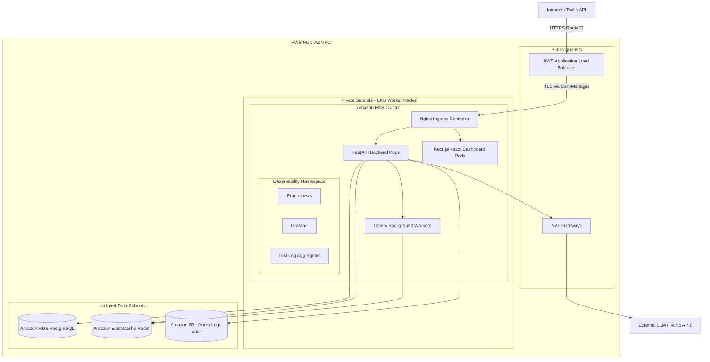
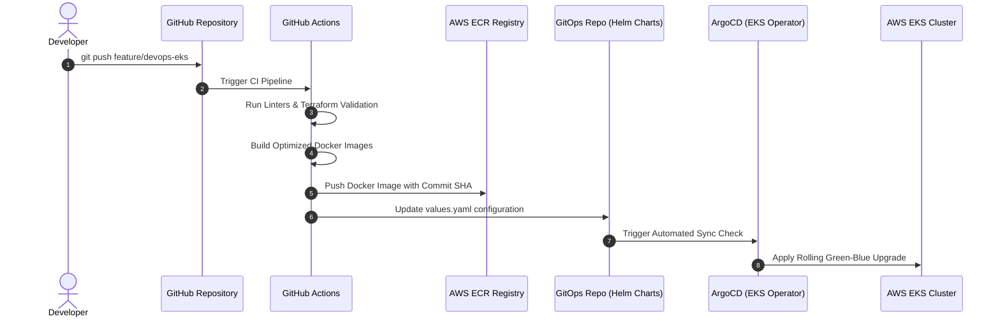

# 🎙️ AI Voice Infrastructure Platform

[](https://www.terraform.io/)
[](https://kubernetes.io/)
[](https://aws.amazon.com/)
[](https://nextjs.org/)
[](https://fastapi.tiangolo.com/)

A production-ready, highly scalable infrastructure platform for deploying and managing cloud-native voice-processing and AI-telephony applications. This repository automates the multi-AZ AWS network routing, EKS cluster provisioning, Helm deployment packaging, containerization, and Prometheus/Grafana/Loki observability patterns.

---

## 🔗 Portfolio Repositories Linkage

This project is split into two sister repositories to separate business application logic from cloud infrastructure engineering:
* **Application Codebase**: Contains the core conversational AI engines, telephony flow runtime, campaign managers, and real-time agent console.
  👉 **[Go to AI Voice Bot Application Repository](https://github.com/sanjanamahajan2001-sys/Alcon-AI-voice-agent)**
* **Infrastructure & Deployment Codebase (This Repository)**: Contains the Terraform IaC configurations, AWS EKS networking modules, Kubernetes/Helm deployment manifests, Docker containers, and Prometheus/Grafana/Loki monitoring dashboards.
  👉 **[Go to AI Voice Infrastructure Platform Repository](https://github.com/sanjanamahajan2001-sys/AI-Voice-Infrastructure-Platform)**

---

## 🎯 Project Goals

This project was created to explore and demonstrate:
- **Scalable Kubernetes patterns** for high-concurrency WebSocket and real-time media stream voice applications.
- **Reusable Terraform modules** for multi-AZ AWS infrastructure supporting PostgreSQL, Redis, and S3.
- **Production-style CI/CD workflows** for automated container builds, validation scans, and EKS deployments.
- **Cloud-native observability** for tracking network traffic, P99 audio latency, stream density, and logging profiles.
- **Cost-optimized compute** using selective EC2 nodes and HPA parameters.

---

## 🏗️ Architecture

The system is built on **AWS EKS** (Elastic Kubernetes Service) to handle dynamic, high-concurrency real-time conversational voice processing.

### Infrastructure Components
- **IaC**: Modular, reusable Terraform configurations provisioning VPC, AWS EKS, RDS PostgreSQL, and ElastiCache Redis.
- **Backend Service**: Highly optimized containers hosting asynchronous FastAPI engines with live-stream Media socket support.
- **Frontend/Dashboard**: Responsive dashboards for agent management and CTI screen-pops.
- **Networking**: High-performance Nginx Ingress Controllers with AWS Application Load Balancer and Cert-Manager for automatic SSL termination.

### 1. System Architecture



### 2. CI/CD Deployment Flow



---

## 🛠️ Complete DevOps Build & EKS Deployment Guide

To deploy the **[Alcon-AI-voice-agent](https://github.com/sanjanamahajan2001-sys/Alcon-AI-voice-agent)** business application on this infrastructure platform, follow this rigorous build and delivery pipeline.

### 📦 A. Optimized Multi-Stage Containerization

All application workloads are compiled using multi-stage base builds to optimize layer-caching structures and reduce final runner container weights.

#### 1. Backend Container Construction (`docker/backend.Dockerfile`)
The backend build divides compiling tasks (like PostgreSQL client compilation) from the runtime executor environment:
```dockerfile
# Stage 1: Build & Compile Layer
FROM python:3.11-slim as builder
WORKDIR /app
RUN apt-get update && apt-get install -y \
    build-essential \
    libpq-dev \
    && rm -rf /var/lib/apt/lists/*
COPY requirements.txt .
RUN pip install --no-cache-dir --user -r requirements.txt

# Stage 2: Minimal Runtime Layer
FROM python:3.11-slim
WORKDIR /app
COPY --from=builder /root/.local /root/.local
COPY . .
ENV PATH=/root/.local/bin:$PATH
EXPOSE 8000
CMD ["uvicorn", "main:app", "--host", "0.0.0.0", "--port", "8000"]
```

#### 2. Running Local Docker Builds
```bash
# Build the FastAPI telephony backend container
docker build -t alcon-backend:latest -f docker/backend.Dockerfile ../Alcon-AI-voice-agent/

# Build the Vite/Next.js dashboard frontend container
docker build -t alcon-frontend:latest -f docker/frontend.Dockerfile ../Alcon-AI-voice-agent/
```

---

## ☸️ Kubernetes Base Configurations Context

The Kubernetes workload configs are mapped out under the `kubernetes/base/` directory and designed to deploy the specific application processes.

### 1. Workload Directories & Pod Blueprint

| Target Deployment | Namespace | Service Type | Active Ports | Associated Code Module |
| :--- | :--- | :--- | :--- | :--- |
| **`backend-deployment`** | `alcon-core` | `ClusterIP` | `8000` (FastAPI Webhooks & WebSockets) | Handles Twilio Media Streams, webhook intent classification, and database transaction queries. |
| **`celery-worker-deployment`** | `alcon-core` | None (Worker) | None | Executes campaign scheduling loops, DND validations, and dialer retry executions asynchronously. |
| **`frontend-deployment`** | `alcon-core` | `ClusterIP` | `3000` (Next.js Dashboard) | Renders the live-agent analytics console, CTI screen-pops, and visual flow builder canvas. |

### 2. Network Ingress & SSL Termination
* **Ingress Controller**: An **Nginx Ingress Controller** intercepts traffic routed by the AWS Application Load Balancer.
* **SSL Certificates**: **Cert-Manager** automates ACM DNS validation challenges, terminating TLS 1.3 encryption boundaries at the Nginx Ingress gateway.
* **Sticky Sessions**: Enabled on `/ws/voice` paths to guarantee bidirectional VoIP streams are pinned to the same stateful FastAPI pod without dropping connection state.

---

## 📊 Infrastructure Validation & Live Status Mocks

### 1. Terraform Plan Output
```text
$ terraform plan
...
Terraform will perform the following actions:
  + module.vpc.aws_vpc.main
  + module.eks.aws_eks_cluster.main
  + module.eks.aws_eks_node_group.worker_nodes
  + module.database.aws_db_instance.postgres
  + module.database.aws_elasticache_cluster.redis

Plan: 24 to add, 0 to change, 0 to destroy.
```

### 2. Verified Kubernetes Deployment Status
```text
$ kubectl get pods -n alcon-core

NAME                               READY   STATUS    RESTARTS   AGE
alcon-backend-7d89f4b5-x2p89       1/1     Running   0          12m
alcon-frontend-5d9d9f8c-m9lqz      1/1     Running   0          12m
celery-worker-6b9c9f8a-z4q12       1/1     Running   0          8m
redis-master-0                     1/1     Running   0          45m
prometheus-server-abc12            1/1     Running   0          2h
```

---

## 📂 Repository Layout

```bash
ai-voice-infrastructure-platform/
├── terraform/          # IaC modules for VPC, EKS Cluster, RDS Postgres, ElastiCache
│   ├── modules/        # Child modules for network, compute, database layers
│   ├── main.tf         # Main provisioning logic
│   └── variables.tf    # Infrastructure input variables
├── kubernetes/         # K8s Manifests 
│   └── base/           # Base deployment, service, ingress, HPA setups
│       ├── backend-deployment.yaml
│       ├── celery-deployment.yaml
│       ├── frontend-deployment.yaml
│       └── hpa.yaml
├── docker/             # Optimized slim Dockerfiles
│   ├── backend.Dockerfile
│   └── frontend.Dockerfile
├── monitoring/         # Observability
│   └── grafana-dashboard.json
├── .github/workflows/  # CI/CD pipelines (linter scan, terraform validate, docker push)
└── README.md           # Master DevOps architecture guide
```

---

## 🤝 Portfolio Connections & Contact
Built by **Sanjana Mahajan**.
- **Portfolio**: [personal-portfolio-gold-phi-44.vercel.app](https://personal-portfolio-gold-phi-44.vercel.app)
- **LinkedIn**: [linkedin.com/in/sanjana-mahajan-467982233/](https://www.linkedin.com/in/sanjana-mahajan-467982233/)
- **Email**: [sanjanamaahi2001@gmail.com](mailto:sanjanamaahi2001@gmail.com)
